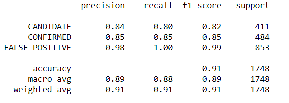
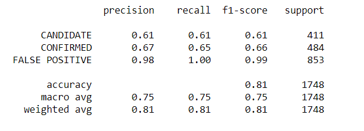
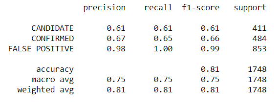

# machine-learning-challenge

Project Description

We were tasked to data collected from the NASA Kepler space telescope on possible exoplanets. This was to be accomplished using machine learning. We had to preprocess the raw data, select the model, tune the model, then predict the models accuracy. 

Tools Required

SciKit learn (model_selection, preprocessing, linear_model, metrics, svm, ensemble)
Joblib
Pandas
Jupyter Notebook

Instructions

•	Read CSV and clean data
•	Select features from column headers
•	Create a Train Test split using sklearn.model_selection
•	Scale data using MinMaxScaler
•	Import model and train
•	Get scores for model
•	Train the model 
•	Hyperparameter Tune the model with GridsearchCV
•	Save model

Files

Model-rf.ipynb – Follows the instructions to read the exoplanet_data.csv file to a jupyter notebook through selection the RandomForestClassifier model. The model is trained and tuned for accuracy. 

Model-LoRegress.ipynb – Follows the instructions to read the exoplanet_data.csv file to a jupyter notebook through selection the LogisticRegression model. The model is trained and tuned for accuracy.

Model-SVM.ipynb – Follows the instructions to read the exoplanet_data.csv file to a jupyter notebook through selection the Support Vector Machine model. The model is trained and tuned for accuracy. 

Analysis

A comparison of each model's performance.

I started off using linear models: SVM and LogisticRegression. I also looked through the data and selected features based on what sounded important. The scores and accuracy were less than 0.65 which lead me to add more features. The accuracy of the SVM and LogisticRegression models were both 0.81 which is below the desired accuracy of 0.85. This led to the selection of a RandomForestClassifier model which could handle more features and had a higher accuracy of 0.90.

A summary about your findings and any assumptions you can make based on your model (is your model good enough to predict new exoplanets? Why or why not?)

The RandomForestClassifier model was the best model selected to predict new exoplanets. I assumed that that less features would give higher accuracies, but it gave lower accuracies. After running the GridseachCV, there was no real optimizing the parameters the accuracy was steady. I ran a classification report and I am confident that the RandomForestModel is good enough to predict new exoplanets.

What would make your model be better at predicting new exoplanets?

The only thing I could think of to increase accuracy is adding a few more features. I could adjust a few more parameters but I wouldn’t expect an increase in accuracy.
